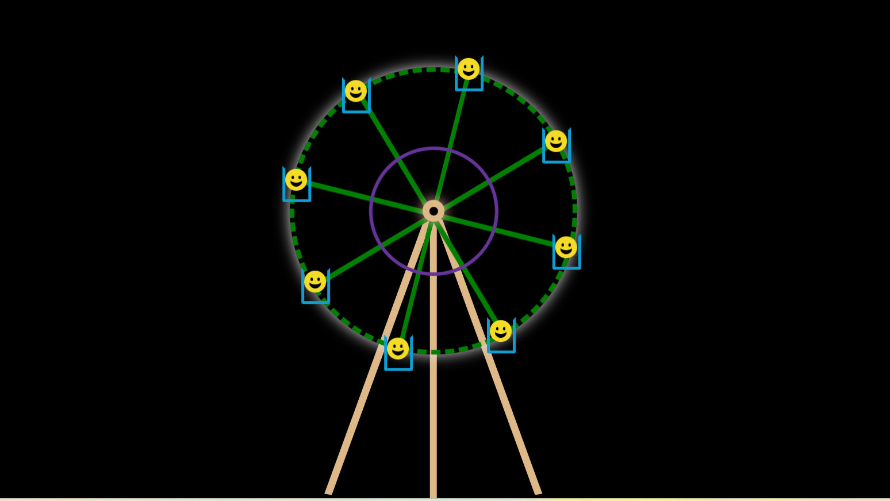
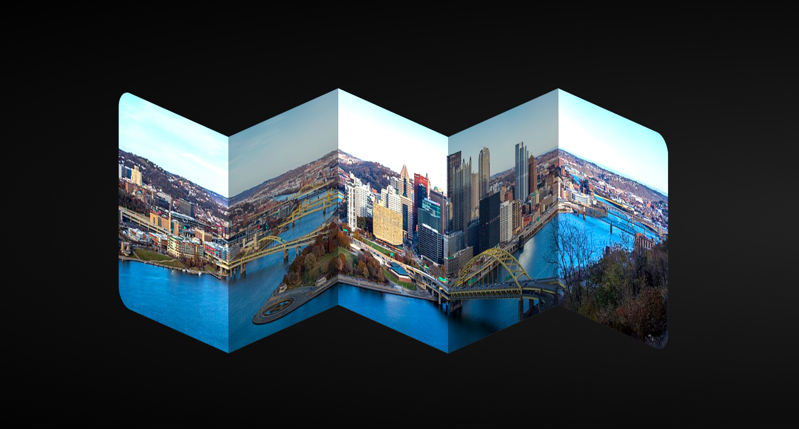
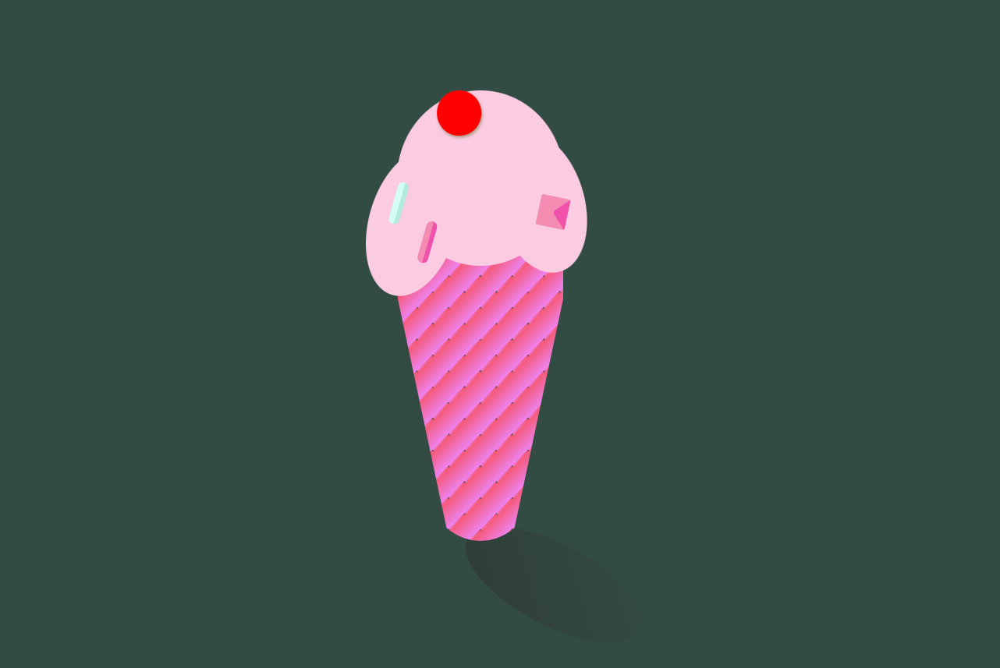

# Folding Panorama Animation & Merry-go-round & CSS Ice-Cone

A creative folding panorama animation built using pure HTML and CSS.  
This project creates a smooth 3D folding visual effect using CSS transforms, perspective, and transition animations.

---
A creative merry-go-round animation built using pure HTML and CSS.  
This project creates a smooth 3D carousel effect using CSS transforms, perspective, and transition animations.

----
A creative CSS Ice-Cone using HTML and CSS.  
This project creates a smooth 3D carousel effect using CSS transforms, perspective, and transition animations.

## 🚀 Features

- Pure HTML & CSS
- Smooth folding animation
- 3D transform effects
- Responsive layout
- Lightweight and fast
- Modern UI design

---

## 🛠️ Technologies Used

- HTML5
- CSS3

---

## 📸 Preview





---

## 📂 Project Structure

```bash
project-folder/
 ├── index.html
 ├── style.css
 └── screenshots/
```

---


## 🎨 Animation Highlights

- CSS perspective effect
- Folding panorama layout
- Smooth hover transitions
- 3D rotation animation
- Clean and modern styling

---


## 👨‍💻 Author

**Mohd Mustfa**

Frontend Developer passionate about creating interactive UI animations.

---

## 📄 License

This project is licensed under the MIT License.